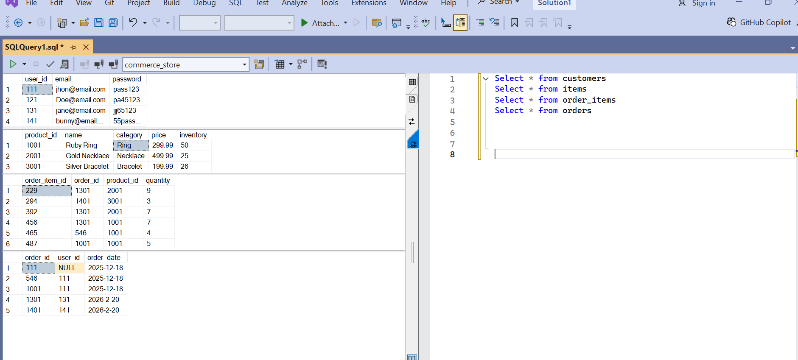
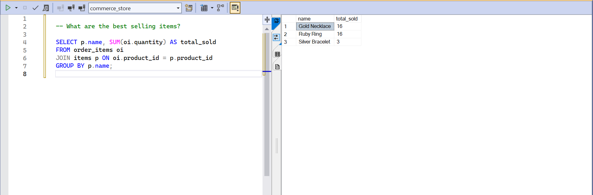
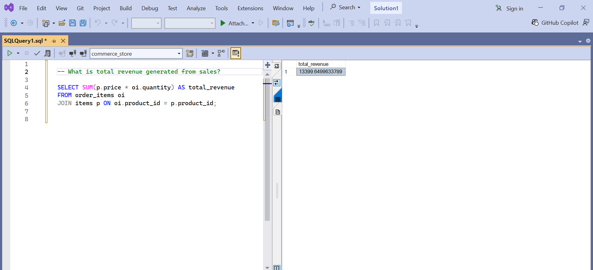

# E-commerce-store-Database-SQL
A relational database designed to support an e-commerce jewelry store.

## Overview
This project models customer information, product inventory, customer orders, and order details using SQL.

## Features
- Product catalog management
- Order tracking system
- Relational database structure
- Foreign key relationships

## Database Structure
### Tables
- users
- items
- orders
- order_items

## Example Queries

### What are the best performing products?
SELECT p.name, SUM(oi.quantity) AS total_sold
FROM order_items oi
JOIN items p ON oi.product_id = p.product_id
GROUP BY p.name;

### How much total revenue was generated? 
SELECT SUM(p.price * oi.quantity) AS total_revenue
FROM order_items oi
JOIN items p ON oi.product_id = p.product_id;

## Technologies Used
- SQL
- Visual studio
## Screenshots

## Design Notes
The database was designed to reflect an e-commerce system with tables and relations.

## Future Improvements
- Detailed customer profiles (CRM)
- Inventory tracking updates	
- Integration with frontend application
  
